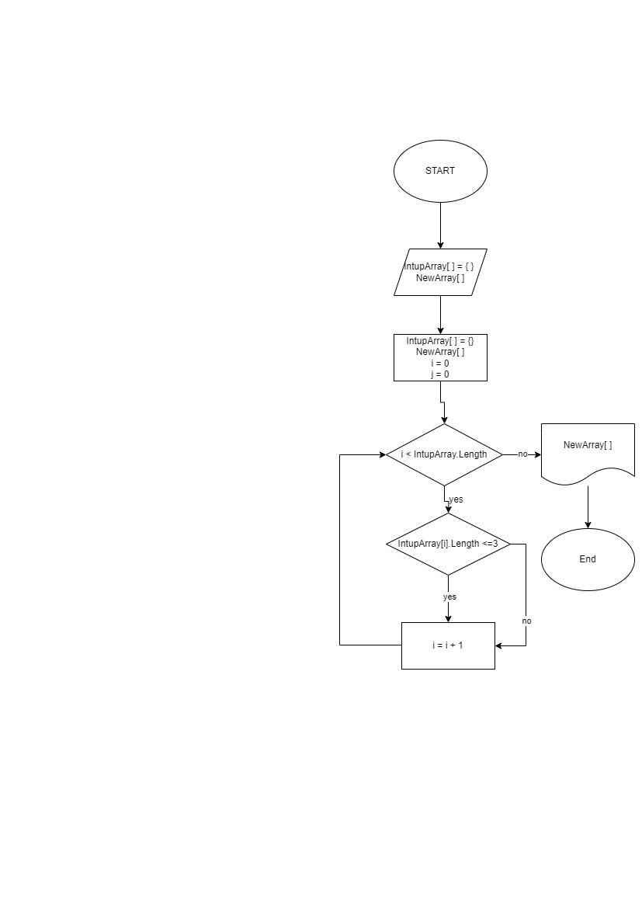

# Описание решения:
Инициализация необходимых переменных, массивов:
## Создание массива типа string с наименованием *InputArray*.
Массив изначальный. Данные самостоятельно вводятся в строчке с массивом.

Создание массива типа *string* с наименованием *NewArray*.
Массив конечный.

Создание функций: PrintArray(), CreateNewArray():
Функция PrintArray(string [] array) заполняет и выводит массив.
Функция CreateNewArrya(string [] array1, string [] array2) формирует новый массив из начального, заполняя его только теми жлементами массива, длина которых меньше либо равна трем символам.
## Вызов функций:
PrintArray() - выводим изначальный массив,
CreateNewArray() - формируем новый массив,
PrintArray() - выводим новый массив

